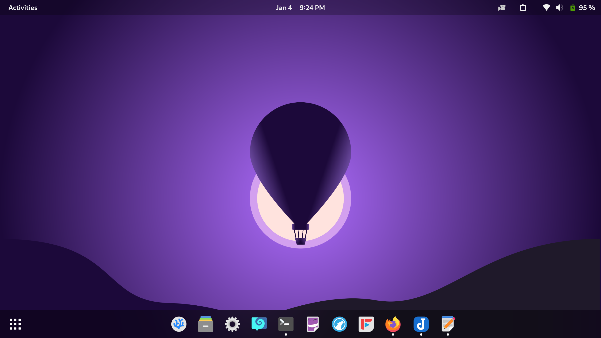

# What is CSS-Desktop?
 CSS-Desktop is meant to be a recreation of the Gnome desktop environment, with my setup specifically for now. 
 I use extensions like dash-to-dock, blur-my-shell etc. The goal was originally just to make a non-functional
 look-alike interface, but I now see that it can be extended much further...
 ## My Current Desktop
 
 I've created the wallpaper in Inkscape myself by-the-way...

# What will it be able to do?
I would like CSS-Desktop to try to replicate gnome's functionality as close as possible. From the activities menu,
to the app launcher and window management, CSS-Desktop aims to include it all. After the initial theming, and window
management system is completed, CSS-Desktop can start introducing apps.

# What is the current plan?
## Current Problems
Currently, there are problems regarding the wrapping of the top menu bar and window resizing. These need to be fixed,
and maybe the entire components have to be recreated in a modular way... (I am not planning to use any css, or js 
framworks for this project currently.) 

## The Gnome Experience
Modularity has to be the main aspect taken into consideration so as to create easily maintainable feature additions. 
A unified stylesheet (with css variables) will be created for some global classes, to get the main 'Gnome' experience. 
(I'm talking about a very tightly followed design language). Some template 'components' would be created for this.
This is the present challange, to unify everything.

## Non-Window Interfaces
The notifications/calander interface, control-center, and the overviews (activities -> apps) need to be created with the
newly established styling standards. They need to _mostly_ work. Battery, Wifi, and other things may be hard due to browser
limitations, but nothing should be left non-semi-functional... The background processes and the whole OS part of things can 
be left incomplete, that would be integrated and redefined later.

## The Windowing System
Once, CSS-Desktop has a solid base the windowing system needs to be attended to. This is where the JS comes into play.
A extendable way of creating, addressing, and managing windows need to be made. A sort of an internal API that handles
all the windows is going to have to be created. This API would be able to provide an easy way to create a window, add it
to the list of open apps, and manage multiple instances of an app. The right-click menus in the bottom dock should work.
A major challange in this is the active windows and how they will stack on each other (z-index). This API also has to deal
with window snapping. 

## The Apps
This part is very tricky and all steps prior to it must keep its implementation in mind. The windows will have running contents,
and things should be able to work within them. Currently, I'm planning to run the apps off of iframes (I understand that it
may be tricky to get them to interact with the desktop/underlying OS, so maybe some other window-content template.) The goal is to
have developers make HTML/CSS/JS 'apps' that run in the windows. It would be really cool if they could be written in C and compiled 
to WASM, but im getting ahead of myself. Anyways, once CSS-Desktop has a way to display apps, the challange of permissions arises...
Developers shouldn't be able to just delete parent components of the app they make. (I don't know how this might be possible)

## The Filesystem
Once the apps are able to run, they must have a way to run other stuff and access files. This is the OS part of things. Currently, this
is already waaaay too far off, and this project will most likely never reach this stage. However, just for the fun of it let's think of
a way to get a weird filesystem working. So, I think that making a GitHub repo of a skeleton OS filesystem, would be the way to go. The
'OS' would access the repo and see the files in it, then take it all into 'memory' and run off of that. This means each session would be
reset as on 'boot' the filesystem would entirely be reloaded.

## Somewhere along the way...
If this is going to turn into a funky OS, it might as well be good to define standards and API's too. This project could extend as deep
as needed. It could stop at just having the users link their google cloud shell, or their actual shell (a node runtime that serves 
the website would be needed for this). It could however also extend to developing a complete implementation of an OS in js. I'm sure this
already exists... Infact, im sure what CSS-Desktop ultimately aims to be already exists too.. A website that runs an OS and looks beautiful.
Its the implementation that matters though, and this could end up being really cool (or a failed sideproject on which I've already spent too much
time writing this who knows?)
